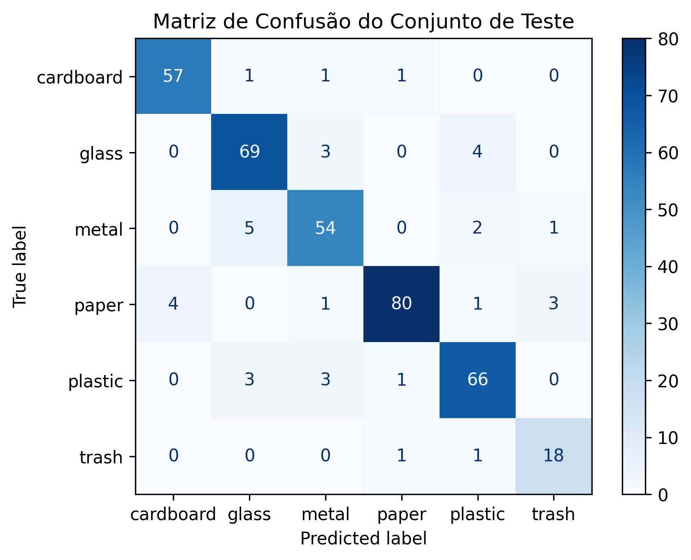

# ♻️ EcoSort AI: Classificador de Resíduos com Transfer Learning

> **Status:** Concluído ✅  
> **Modelo:** ResNet50 (Transfer Learning)  
> **Acurácia Final:** 90.53% (TrashNet)

O **EcoSort AI** é um projeto de Visão Computacional focado na automação da reciclagem. O objetivo é classificar resíduos em 6 categorias para auxiliar na triagem correta, utilizando Deep Learning de ponta.

O projeto aborda desafios reais de engenharia, como **datasets desbalanceados** e **viés de contexto** (background bias), demonstrando a diferença entre performance em ambiente controlado e aplicação no mundo real.


---

## 🗂️ Estrutura do Projeto

```text
waste-classifier-pytorch/
│
├── TrashNet/            # Dataset (baixar separadamente)
│
├── src/
│   └── notebook.ipynb   # Código principal
│
├── models/              # Modelos salvos
│
├── requirements.txt     # Dependências
│
└── README.md            # Este arquivo
```

---

## 🛠️ Tecnologias Utilizadas

- **PyTorch:** Construção do modelo e treinamento
- **Torchvision:** Transfer Learning e transformações
- **Pillow:** Processamento de imagens
- **Matplotlib/Seaborn:** Visualizações e matriz de confusão
- **Scikit-learn:** Métricas de avaliação e split estratificado

---

## 📊 Sobre o Dataset (TrashNet)

Utilizou-se o dataset padrão da indústria, **TrashNet**, contendo 2.527 imagens divididas em 6 categorias.

### 🔹 Classes

- 📦 **Cardboard** (Papelão)
- 🍷 **Glass** (Vidro)
- 🔩 **Metal**
- 📄 **Paper** (Papel)
- 🧴 **Plastic** (Plástico)
- 🗑️ **Trash** (Lixo Geral)

### 🔹 Desafio: Dataset Desbalanceado

O dataset original apresenta forte desbalanceamento (muito papel, pouco lixo geral), o que pode causar viés no modelo.

#### 📌 Soluções Implementadas:

**1. Split Estratificado**
- Mantém a proporção de classes em Treino/Validação/Teste
- Garante que todas as classes estejam representadas adequadamente

**2. Balanceamento via Pesos**
- `WeightedRandomSampler` durante o treinamento
- Pesos na Loss Function calculados inversamente à frequência das classes
- Penaliza mais o modelo quando erra classes minoritárias (como `Trash`)

---

## 🧠 Arquitetura do Modelo

Utilizamos **Transfer Learning** para contornar a escassez de dados e acelerar a convergência.

### 🔹 Backbone

- **ResNet50** pré-treinada na ImageNet
- Feature Extractor congelado (pesos mantidos fixos)
- Aproveita representações visuais aprendidas de 1.4 milhões de imagens

### 🔹 Classificador Customizado

```python
classifier = nn.Sequential(
    nn.Linear(2048, 1024),
    nn.ReLU(),
    nn.Dropout(0.5),        # Crucial para regularização
    nn.Linear(1024, 6)      # 6 classes de resíduos
)
```

**Dropout (0.5)** foi essencial para evitar overfitting dado o tamanho reduzido do dataset.

---

## 📈 Resultados em Ambiente Controlado

O modelo atingiu resultados competitivos com o Estado da Arte para este dataset.

| Métrica | Valor |
|---------|-------|
| **Acurácia (Teste)** | **90.53%** |
| **Épocas Treinadas** | 18 (Early Stopping) |
| **Tempo de Treino** | ~15 minutos (GPU T4) |

### 🔹 Análise da Matriz de Confusão
Abaixo, a Matriz de Confusão mostrando os acertos por classe:



**Pontos Fortes:**
- ✅ Excelente distinção entre **Papel** e **Lixo Geral**
- ✅ Alta precisão em **Metal** e **Papelão**

**Desafios Identificados:**
- ⚠️ Confusão entre **Vidro** e **Plástico** devido à transparência e reflexos similares
- ⚠️ Algumas confusões em materiais com textura ambígua

---

## 🧪 Case Study: O Desafio do Mundo Real

Após validar o modelo com 90% de precisão no dataset (fundo branco uniforme), realizamos testes com **fotos reais de smartphone** para testar a robustez em condições não controladas.

### 🚨 Descoberta: Viés de Contexto Significativo

O modelo aprendeu a associar o **fundo** da imagem à classe, não apenas o objeto. Isso demonstra uma limitação crítica para aplicação em produção.

---

### 📱 Caso 1: O "Papelão" de Madeira

**Experimento:**
- Fotografamos uma **folha de papel branca** sobre um **piso de madeira**

**Resultado:**
- 🏷️ **Classe Real:** Paper
- 🧠 **Predição:** `CARDBOARD` (99.9% de confiança)

**Diagnóstico:**
- O modelo associou a cor marrom e textura do chão à classe Papelão
- Ignorou completamente a cor branca e textura lisa do papel
- **Shortcut learning:** Aprendeu atalho visual (fundo) em vez da característica real (objeto)

---

### 🍾 Caso 2: O Vidro Camuflado

**Experimento:**
- Fotografamos uma **garrafa de vidro** em ambiente complexo com fundo variado

**Resultado Inicial:**
- 🏷️ **Classe Real:** Glass
- 🧠 **Predição:** `PLASTIC` (83% de confiança)

**Correção:**
- Ao recortar a imagem e deixar apenas o objeto com **fundo branco**
- 🧠 **Nova Predição:** `GLASS` (99.7% de confiança) ✅

**Diagnóstico:**
- O modelo só funciona bem em condições similares ao treinamento (fundo neutro)
- Background tem peso desproporcional na decisão

---

## 🔬 Análise Técnica do Viés

### Por que isso acontece?

1. **Dataset Homogêneo:** TrashNet possui todas as imagens com fundo branco/neutro
2. **Feature Learning:** A rede aprendeu que fundo marrom/texturizado = Papelão
3. **Ausência de Variabilidade:** Não há exemplos de papel em fundos escuros ou papelão em fundos claros

### Impacto em Produção

Para um **aplicativo mobile de reciclagem**, este viés torna o modelo **não confiável** em ambientes reais:
- ❌ Funcionaria mal em casas com pisos variados
- ❌ Falharia em ambientes externos
- ❌ Seria confundido por iluminação diferente

---

## 🚀 Roadmap: Próximos Passos para Produção

Para tornar o EcoSort AI robusto para aplicação real, seriam necessárias as seguintes melhorias:

### 🔹 1. Segmentação Prévia

Implementar um modelo de segmentação (ex: **U-Net** ou **Mask R-CNN**) para:
- Isolar o objeto do fundo
- Remover background antes da classificação
- Pipeline de dois estágios: Segmentação → Classificação

### 🔹 2. Data Augmentation Avançado

- **Mosaic Augmentation:** Inserir fundos aleatórios durante o treino
- **CutOut:** Mascarar partes da imagem para forçar o modelo a não depender de contexto
- **MixUp:** Misturar imagens de diferentes classes

### 🔹 3. Dataset Expandido

- Coletar imagens com fundos diversos (madeira, concreto, grama, etc.)
- Incluir variações de iluminação (dia, noite, sombra)
- Adicionar objetos em diferentes ângulos e distâncias

### 🔹 4. Domain Adaptation

- Treinar em imagens sintéticas com fundos variados
- Aplicar técnicas de **Domain Randomization**
- Fine-tuning em dados reais coletados de usuários

---

## ⚙️ Como Executar

### 1️⃣ Clone o repositório

```bash
git clone https://github.com/oalvarobraz/eco-sort-ai.git
cd eco-sort-ai
```

### 2️⃣ Baixe o dataset

Acesse o [TrashNet Dataset](https://www.kaggle.com/datasets/feyzazkefe/trashnet/code) e extraia `TrashNet/`

### 3️⃣ Instale as dependências

```bash
pip install -r requirements.txt
```

### 4️⃣ Execute o notebook

```bash
jupyter notebook src/notebook.ipynb
```

---

## 📦 Dependências Principais

```text
torch>=2.0.0
torchvision>=0.15.0
pillow>=9.0.0
matplotlib>=3.5.0
seaborn>=0.12.0
scikit-learn>=1.2.0
numpy>=1.23.0
pandas>=1.5.0
```

---

## ✅ Principais Aprendizados

- **Transfer Learning:** ResNet50 acelerou drasticamente o treinamento e melhorou a generalização
- **Balanceamento de Classes:** Pesos na loss function foram cruciais para lidar com desbalanceamento
- **Viés de Dataset:** Identificação prática de shortcut learning e suas implicações em produção
- **Gap Lab → Real:** Métricas em ambiente controlado não garantem performance em aplicação real
- **Segmentação como pré-processamento:** Essencial para aplicações de visão computacional robustas

---

## 🎯 Conclusão

O **EcoSort AI** demonstra tanto o **potencial** quanto as **limitações** de Deep Learning aplicado a problemas reais. Com 90.53% de acurácia em ambiente controlado, o modelo prova a eficácia do Transfer Learning. Porém, os testes em condições reais revelam a importância crítica de:

1. **Dataset diversificado** que represente o ambiente de produção
2. **Pré-processamento robusto** (segmentação de objetos)
3. **Validação além das métricas** - testar em cenários não controlados

Este projeto serve como estudo de caso valioso sobre a diferença entre **validação de laboratório** e **robustez no mundo real**.

---

## 📌 Autor

Projeto desenvolvido para fins de **estudo, pesquisa e portfólio profissional em Visão Computacional e Deep Learning**.

---

## 📄 Licença

Este projeto está sob a licença MIT. Veja o arquivo `LICENSE` para mais detalhes.

---

## 🙏 Agradecimentos

- **TrashNet Dataset:** Gary Thung & Mindy Yang
- **PyTorch Team:** Pela framework excepcional
- **Comunidade de Deep Learning:** Pelas discussões sobre domain adaptation e robustez de modelos